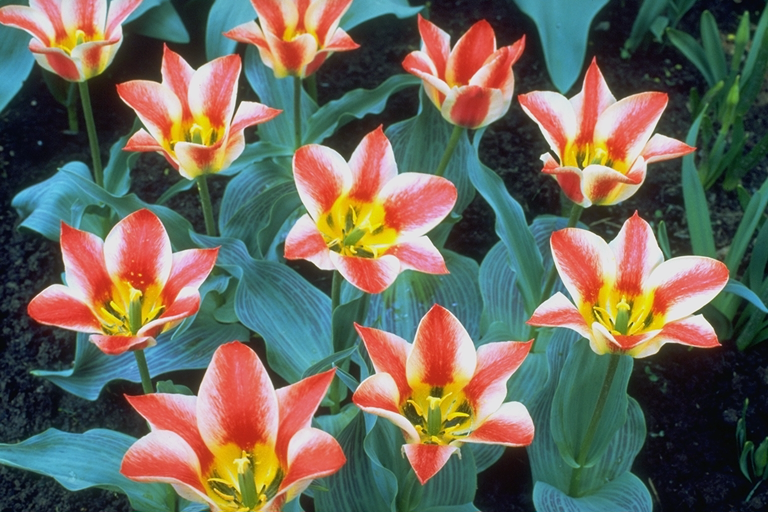

# Spline Color Adjustment Tool

This project is a Java Maven application built using NetBeans IDE and Swing that allows users to adjust the colors of an image through a **cubic interpolated spline**. The application provides fine control over the RGB and Alpha channels, enabling creative and precise image adjustments.

  

## **Features**

- **Color Channel Adjustment**: Adjust individual color channels (Red, Green, Blue, and Alpha) using spline curves to achieve precise color corrections or artistic effects.
- **Image Preview**: Preview the adjusted image in the interface before saving.
- **User-Friendly Controls**: Drag, click or delete control points on spline curves to define custom transformations for each channel.

## **How to Use**

1. **Execute the `.jar` file** located in the `/target` folder: `SplineColorAdjuster.jar`.

2. **Load an Image**:
   - Drag and drop an image into the interface.

3. **Adjust Colors**:
   - Modify the spline curves for the chosen channel or all at once (Red, Green, Blue, Alpha) by dragging control points.

4. **Save the Image**:
   - Once satisfied with the adjustments, click the "Save" button.
   - The adjusted image will be saved in the same folder as the original with the name: 
     `originalname_ColorAdjusted[type].png`.

## **Examples**

### Original Images

  
  

### Adjusted Images

  
  

In the example above, spline curves were used to enhance the contrast and adjust the RGB and RED channels for a artistic look.

